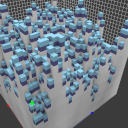
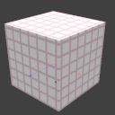
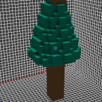

# Scripting api

There is a console command (called `xs`) in [voxedit](voxedit/Index.md) and a command line parameter in [voxconvert](voxconvert/Index.md) to execute lua scripts for generating voxels. This command expects the lua script filename (`.lua` can be omitted) and the additional arguments for the `main()` method.

---

> If you are new to lua you can read more about it on [lua-users](http://lua-users.org/wiki/TutorialDirectory).

---

> **voxedit**
>
> Calling `xs <script> help` (in the script console) will print the supported arguments for the given script file in voxedit.

---

> **voxconvert**
>
> ```
> ./vengi-voxconvert --script "<script> help" --scriptcolor 1 --input in.qb --output out.qb
> ```
>
> `--scriptcolor` defines the color palette index that is given to the script as parameter.

---

By default the script files will be searched in a `scripts` folder next to where the binary is located and in the usual search paths (see [configuration](Configuration.md) for more details). You can also give the full path to the script file.

There are two functions in each script. One is called `arguments` and one `main`. `arguments` returns a list of parameters for the `main` function. The default parameters for `main` are `node`, `region` and `color`. `color` is the palette index starting from `0`.

## Examples

### Without parameters

```lua
function main(node, region, color)
	local volume = node:volume()
	local mins = region:mins()
	local maxs = region:maxs()
	for x = mins.x, maxs.x do
		for y = mins.y, maxs.y do
			for z = mins.z, maxs.z do
				volume:setVoxel(x, y, z, color)
			end
		end
	end
end
```

Execute this via console `xs scriptfile`

### With one parameter

```lua
function arguments()
	return {
		{ name = 'n', desc = 'height level delta', type = 'int', default = '2' }
	}
end

function main(node, region, color, n)
	[...]
end
```

Execute this via console `xs scriptfile 1` where `1` will be the value of `n`. Omitting the `1` will add the `default` value from the argument list.

### Find the best palette match

```lua
function main(node, region, color)
	-- find match (palette index) for red in the current palette (RGB value)
	-- this value can be used in e.g. volume:setVoxel(x, y, z, match)
	local match = node:palette():match(255, 0, 0)
	[...]
end
```

This will find the best match in the currently used palette and return the index.

## Arguments

Supported `type`s are:

* `int`: `min`, `max` values are supported, too
* `float`: `min`, `max` values are supported, too
* `enum`: `enum` as a property specifies a list of string separated by `,`
* `str`: string input
* `colorindex`: a color index from current palette (clamped)
* `bool`:

The `desc`ription field is just for the user interface of the script parameter list.

A `default` value can get set, too.

The order in the arguments table defines the order in which the arguments are passed over to the script.

## SceneGraph

`g_scenegraph` lets you access different nodes or create new ones.

The functions are:

* `align()`: Allow to align all nodes on the floor next to each other without overlapping.

* `new(name, region[, visible])`: Creates a new node with the given `name`, the size and position according to the `region` and an optional `visible` parameter.

* `get([nodeId])`: Returns the `node` for the given `nodeId` - if the `nodeId` is not given, it will return the current active node. Which by default is the node for the volume the script is currently executed for.

* `nodeIds()`: Returns a table with all node ids of the current scene graph.

```lua
local allNodeIds = g_scenegraph.nodeIds()
for i, nodeId in ipairs(allNodeIds) do
  -- Do something with each nodeId
end
```

* `updateTransforms()`:

## SceneGraphNode

* `addAnimation(string)`: Add a new animation

* `addKeyFrame(frame)`: Add a new key frame for frame number and return it. E.g. `addFrame(20)` will add a new key frame for the frame 20.

* `id()`: Returns the id of the current node

* `isModel()`: Returns true if the node is a model node (it has a volume attached)

* `isReference()`: Returns true if the node is a model reference

* `keyFrame(keyFrameIdx)`: Returns an existing keyframe (see below)

* `keyFrameForFrame(frame)`: Returns an existing keyframe that has a frame number <= the given frame

* `name()`: Returns the current name of the node.

* `setName(string)`: Set the name of the node.

* `palette()`: Returns the current palette of the node.

* `parent()`: Returns the id of the parent node - or `-1` if no parent exists (root node)

* `setAnimation(string)`: Activate the animation

* `setPalette(palette, [remap])`: Change the palette or if remap is given and is true it remaps to the new palette

* `setPivot(vec3)`, `setPivot(x, y, z)`:

* `volume()`: Gives you access to the volume of the node.

Access these functions like this:

```lua
local scenegraphnode = [...]
local name = scenegraphnode:name()
```

## Keyframe

> Valid interpolation strings
>
> * Instant
> * Linear
> * QuadEaseIn
> * QuadEaseOut
> * QuadEaseInOut
> * CubicEaseIn
> * CubicEaseOut
> * CubicEaseInOut

* `index()`: Returns the key frame index

* `frame()`: Returns the frame for this key frame object

* `interpolation()`: Returns interpolation string

* `setInterpolation(string)`: Set the interpolation for this key frame - must be a valid string

* `localScale()`: Returns the local scale vector

* `setLocalScale(vec3)`, `setLocalScale(x, y, z)`:

* `localOrientation()`: Returns a quaternion object

* `setLocalOrientation(quat)`, `setLocalOrientation(x, y, z, w)`:

* `localTranslation()`: Returns a vec3 object

* `setLocalTranslation(vec3)`, `setLocalTranslation(x, y, z)`:

* `worldScale()`: Returns a vec3 object

* `setWorldScale(vec3)`, `setWorldScale(x, y, z)`:

* `worldOrientation()`: Returns a quaternion object

* `setWorldOrientation(quat)`, `setWorldOrientation(x, y, z, w)`:

* `worldTranslation()`: Returns a vec3 object

* `setWorldTranslation(vec3)`, `setWorldTranslation(x, y, z)`:

> **NOTE** After you've modified something on a key frame, you have to call `g_scenegraph.updateTransforms()`!

## Palette and material

The node palette (`node:palette()`) has several methods to work with colors. E.g. to find a closest possible match for the given palette index.

The functions are:

* `color(paletteIndex)`: Pushes the vec4 of the color behind the palette index (`0-255`) as float values between `0.0` and `1.0`.

* `colors()`: Returns the palette RGBA colors as vec4 values.

* `load(palette)`: Allows to load a [built-in palette](Palette.md) or a filename to a supported [palette format](Formats.md).

* `material(paletteIndex, material)`: Get the value of the material property for the given palette index.
> Valid [material](Material.md) names

* `match(r, g, b)`: Returns the closest possible palette color match for the given RGB (`0-255`) color. The returned palette index is in the range `0-255`. This value can then be used for the `setVoxel` method.

* `setColor(paletteIndex, red, green, blue, [alpha])`: Change the color of a palette entry to the given rgba values in the range `[0-255]`.

* `setMaterial(paletteIndex, material, value)`: Set the value of the material property for the given palette index.
> Valid [material](Material.md) names

* `similar(paletteindex, [coloramount])`: Return a table with similar colors given by their palette index.

They are available as e.g. `palette:color([...])`, `palette:match([...])` and so on.

You can create new palettes with the `g_palette` global by calling e.g.

```lua
local pal = g_palette.new()
pal.load("built-in:minecraft")
```

## Noise

The global `g_noise` supports a few noise generators:

* `noise2(v)`, `noise3(v)`, `noise4(v)`: Simplex noise. Uses the given `vec2`, `vec3` or `vec4` and returns a float value between `0.0` and `1.0`.

* `fBm2(v, octaves, lacunarity, gain)`, `fBm3(v, octaves, lacunarity, gain)`, `fBm4(v, octaves, lacunarity, gain)`: Simplex noise fractal brownian motion sum. Uses the given `vec2`, `vec3` or `vec4` and returns a float value between `0.0` and `1.0`.

* `ridgedMF2(v, offset, octaves, lacunarity, gain)`, `ridgedMF3(v, offset, octaves, lacunarity, gain)`, `ridgedMF4(v, offset, octaves, lacunarity, gain)`: Simplex ridged multi-fractal noise sum. Uses the given `vec2`, `vec3` or `vec4` and returns a float value between `0.0` and `1.0`.

* `swissTurbulence(vec2, offset, octaves, lacunarity, gain, warp)`: [blog post](https://www.decarpentier.nl/scape-procedural-extensions)

* `voronoi(vec3, [frequency, seed, enableDistance])`: Voronoi noise.

* `worley2(v)`, `worley3(v)`: Simplex cellular/worley noise. Uses the given `vec2` or `vec3` and returns a float value between `0.0` and `1.0`.

They are available as e.g. `g_noise.noise2([...])`, `g_noise.fBm3([...])` and so on.

## Shape

The global `g_shape` supports a few shape generators:

* `cylinder(centerBottom, axis, radius, height, voxel)`: Create a cylinder at the given position. The position is the center of the bottom plate with the given `axis` (`y` is default) as the direction.

* `torus(center, minorRadius, majorRadius, voxel)`: Create a torus at the given position with the position being the center of the object.

* `ellipse(centerBottom, axis, width, height, depth, voxel)`: Create an ellipse at the given position. The position is the center of the bottom plate with the given `axis` (`y` is default) as the direction.

* `dome(centerBottom, axis, negative, width, height, depth, voxel)`: Create a dome at the given position. The position is the center of the bottom plate with the given `axis` (`y` is default) as the direction. `negative`: if true the dome will be placed in the negative direction of the axis.

* `cone(centerBottom, axis, negative, width, height, depth, voxel)`: Create a cone at the given position. The position is the center of the bottom plate with the given `axis` (`y` is default) as the direction. `negative`: if true the cone will be placed in the negative direction of the axis.

* `line(start, end, voxel)`: Create a line.

* `cube(position, width, height, depth, voxel)`: Create a cube with the given dimensions. The position is the lower left corner.

* `bezier(start, end, control, voxel)`: Create a bezier curve with the given `start`, `end` and `control` point

They are available as e.g. `g_shape.line([...])`, `g_shape.ellipse([...])` and so on.

## Region

* `contains(region)`: Check whether the current region contains the given one. The test is inclusive such that a region is considered to be inside of itself.

* `intersects(region)`: Check whether the current region intersects with the given one.

* `mins()`: The lower boundary of the region (inclusive).

* `maxs()`: The upper boundary of the region (inclusive).

* `size()`: The size of the region in voxels (`ivec3`).

* `setMins(mins)`: The lower boundary of the region - given as `ivec3` (atm only available for palettes created with `new`).

* `setMaxs(maxs)`: The upper boundary of the region - given as `ivec3` (atm only available for palettes created with `new`).

* `x()`: The lower x boundary of the region.

* `y()`: The lower y boundary of the region.

* `z()`: The lower z bounary of the region.

* `width()`: The width of the region measured in voxels.

* `height()`: The height of the region measured in voxels.

* `depth()`: The depth of the region measured in voxels.

Access these functions like this:

```lua
local region = [...]
local mins = region:mins()
```

To create new regions, you can use the `g_region.new` function which needs the lower and upper boundaries. For example

```lua
local myregion = g_region.new(0, 0, 0, 1, 1, 1) -- creates a region with 8 voxels
```

```lua
local myregion = g_region.new(0, 0, 0, 0, 0, 0) -- creates a region with 1 voxels
```

## Volume

* `voxel(x, y, z)`: Returns the palette index of the voxel at the given position in the volume `[0-255]`. Or `-1` if there is no voxel.

* `region()`: Return the region of the volume.

* `text(ttffont, text, [x], [y], [z], [size=16], [thickness=1], [spacing=0])`: Renders the given `text`. `x`, `y`, and `z` are the region lower boundary coordinates by default.

* `fillHollow([color])`: Tries to fill all hollows in the volume.

* `hollow()`: Removes non visible voxels.

* `importHeightmap(filename, [underground], [surface])`: Imports the given image as heightmap into the current volume. Use the `underground` and `surface` voxel colors for this (or pick some defaults if they were not specified). Also see `importColoredHeightmap` if you want to colorize your surface.

* `importColoredHeightmap(filename, [underground])`: Imports the given image as heightmap into the current volume. Use the `underground` voxel colors for this and determine the surface colors from the RGB channel of the given image. Other than with `importHeightmap` the height is encoded in the alpha channel with this method.

* `crop()`: Crop the volume and remove empty spaces.

* `mirrorAxis([axis])`: Mirror along the given axis - `y` is default.

* `move(x, [y], [z])`: Move the voxels by the given units without modifying the boundaries of the volume.

* `rotateAxis([axis])`: Rotate along the given axis - `y` is default.

* `translate(x, [y, z])`: Translates the region of the volume. Keep in mind that this is not supported by every output format.

* `resize(x, [y, z, extendMins])`: Resize the volume by the given sizes. If `extendsMins` is `true` the region dimensions are also increased on the lower corner.

* `setVoxel(x, y, z, color)`: Set the given color at the given coordinates in the volume. `color` must be in the range `[0-255]` or `-1` to delete the voxel.

Access these functions like this:

```lua
local volume = [...]
local region = volume:region()
```

## Vectors

Available vector types are `vec2`, `vec3`, `vec4` and their integer types `ivec2`, `ivec3`, `ivec4`.

Access these functions like this:

```lua
local v1 = g_ivec3.new(1, 1, 1)
```

There are 3 possible components for this vector. You can also call `g_ivec3.new(1)` to fill all three values with a one. Or call it like this: `g_ivec3.new(1, 2)` to create a vector with the three components of `1, 2, 2`.

## Quaternion

For creating quaternions, you can use `g_quat.new()`

* `rotateXYZ(x, y, z)`
* `rotateXY(x, y)`
* `rotateYZ(y, z)`
* `rotateXZ(x, z)`
* `rotateX(x)`
* `rotateY(y)`
* `rotateZ(z)`

## Other

* `y` going upwards.

You have access to the `cvar` and `cmd` lua bindings, too. This means that you can access any `cvar` value or execute any command like `modeladd` or `modelmerge` to modify the whole scene.

```lua
g_cmd.execute("echo test")
g_var.int("cl_gamma")
```

To get a full list of commands and cvars use the console command `cmdlist` and `cvarlist`.

## Available scripts

### cover.lua

Generates a new voxel on top of others with the current selected color and the specified height.



`xs cover.lua 1`

### grass.lua

Generate grass on top of voxels.


`xs grass.lua`

### grid.lua

Generates a grid with given color, thickness and size.



`xs grid.lua 1 1 5 5 5`

### noise.lua

Generates perlin noise with the frequency and amplitude as parameters with the current selected color.


`xs noise.lua 0.3 1.0`

### pyramid.lua

Generates a pyramid with the current selected color and with each level being 3 voxels high.


`xs pyramid.lua 3`

### thicken.lua

Thickens the voxel - take 1 voxel and convert to 8 voxels (creates a new node for the result).

 

`xs thicken.lua 1`

### others

There are other scripts available [in the repository](https://github.com/vengi-voxel/vengi/blob/master/src/modules/voxelgenerator/lua/scripts/).
