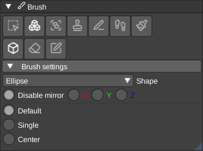
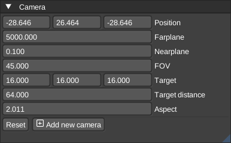
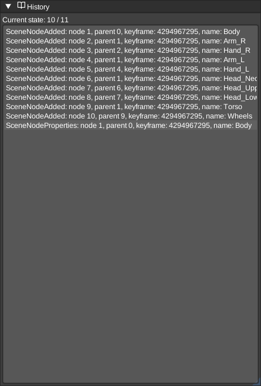
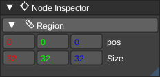
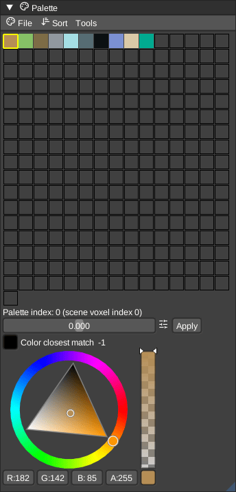
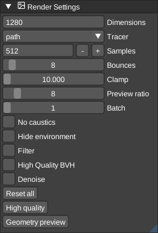
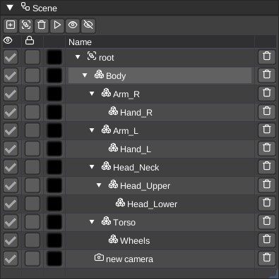
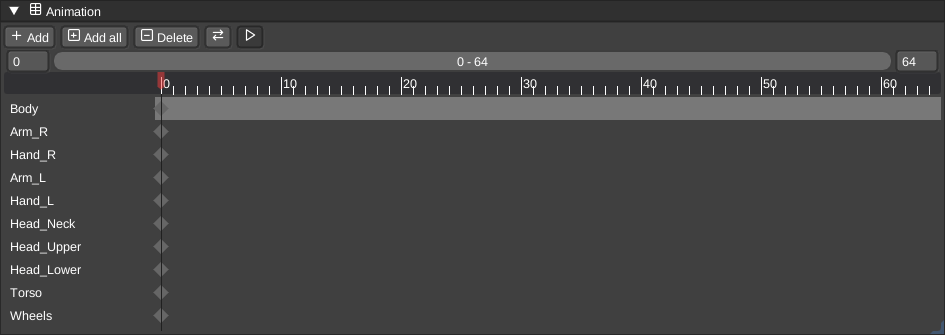
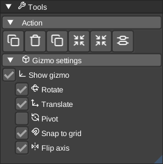
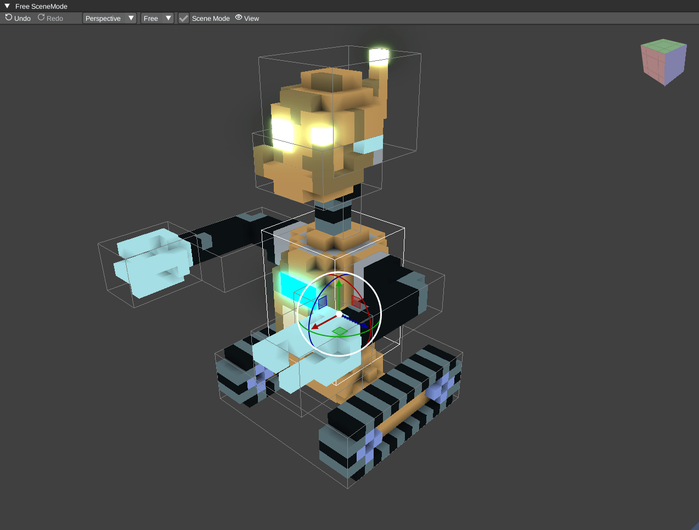

# Usage

## Scene and edit mode

The scene mode is for animating and moving objects in the world - while the edit mode is for modifying voxels in there volumes.

You can toggle between those modes by pressing the `TAB` key in the default binding mode. See [controls](Controls.md).

## Reference position

The current reference position is rendered as a blue dot in the scene (__in edit mode__) and is used to e.g. define the position of where to put procedurally generated content like the trees. It is also used to define the position of where to paste your clipboard at. But also some modifier are using the reference position.

The reference position can be set by pressing enter while hovering a particular voxel - or by using the command `setreferenceposition`.

## Brushes

### Shape brush

You can use several shapes to create voxels via spanning a bounding box in the viewport volume by pressing and holding the left mouse button.

### Script brush

Execute [scripts](../LUAScript.md) with this brush.

### Plane brush

This allows you to extrude a whole plane.

### Stamp brush

Load stamps in form of other voxel assets via drag and drop or right click in the asset panel

### Line brush

Generate a line from the reference position to the current cursor position

### Path brush

Generate a path from the reference position to the current cursor position by walking over existing voxels

## Modifiers

The available brushes support several modifiers.

### Place

Place new voxels in your volume.

### Erase

Erase voxels from your volume. There is a shortcut when you are in the other modes to delete voxels: Press the right mouse button (at least in the default binding).

### Override

Override existing voxels with a new color - but also place new voxels.

### Paint

Other than **override** this modifier only changes the color of existing voxels.

### Path

This modifier puts voxels onto a path using the reference position as start and the position you clicked at as end. This needs solid voxels to work on. This doesn't work in empty volumes.

### Line

A line will just draw a line from the reference position to the position you clicked at. See the bindings window (__Edit__ / __Bindings__) for the binding to place the reference position in the scene (the ).

### Color picker

You can either use it from the modifiers panel or by default with the key `p` to pick the color from the current selected voxel.

### Select

Span an selection box to operate in. Either for copy/pasting or to limit a certain action (like the [script](../LUAScript.md) execution). Don't forget to unselect (__Select__ -> __Select none__) before being able to operate on the whole volume again.

## Asset

This is an online and local asset browser for supported [formats](../Formats.md) from gitlab, github, custom urls and apis

## Camera

Allow you to create camera nodes and modify the current camera values

## Console

See the console logs. Also see the [configuration](../Configuration.md) docs for changing the log level

## LSystem

Generate l-system voxel data

## Memento

Visualizes the undo/redo states

## Node Inspector

The node inspector in edit mode can change the size and the position of the voxel volume. Usually you don't want to modify the position of the volume in edit mode, but in scene mode. See below.

The node inspector in scene mode allows one to change the transforms of the scene graph node. You can rotate, scale and move the node in the world to arrange your objects in your scene.

## Palette

The palette panel visualized the colors for a node. The colors can get re-ordered and changed, as well as drag-and-dropped to change the slots. See the dedicated [palette](../Palette.md) docs for more details.

You can re-order the palette colors by __Hue__, __Saturation__, __Brightness__ or __CIELab__ rules.

Direct LoSpec palette import is possible and next to LoSpec you can import or export a lot other palette [formats](../Formats.md), too.

## Renderer

VoxEdit has built-in support for the yocto pathtracer - see [material](../Material.md) docs for details.

You can configure the pathtracer options here.

## Scene View

Here you can see all the nodes and their hierarchy in the scene. You can change the parents by using drag and drop and use a actions from the context menu for each nodes.

You can hide or show nodes from the viewport or lock them to execute some actions on all locked nodes at the same time.

It's also possible to use the play button to loop through all nodes in your scene. Make sure to check out the `Model animation speed` in the options menu to change the animation speed.

Next to these options you can create new nodes - e.g. model or group nodes here.

## Scripts

Here you can execute the [lua scripts](../LUAScript.md) in the editor to modify your scene or the current active volume (depends on the script).

The arguments given in the script are visualized here. This allows you to extend the script panel with your own fields to execute the scripts.

## Animations

Here you can change or create or delete animations from a scene.

The timeline visualized the key frames for each node for each animation.

## Tools

The scene and the edit mode have different tools for you. You can resize, crop, flip or rotate voxels in edit mode or duplicate, center pivot, align or delete nodes in scene mode.

## Tree

Here you can generate a lot of different tree types - all with their own set of configuration options.

## Viewport

The viewport can get changed to scene and edit mode. You can switch the cameras from orthogonal to projection, you can record videos of your scene or let the camera automatically rotate.
